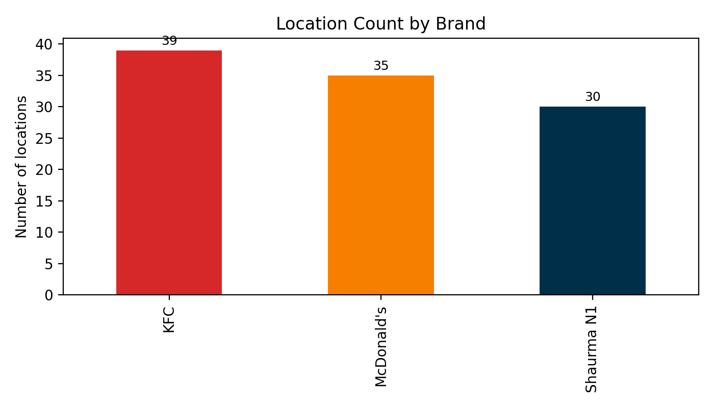
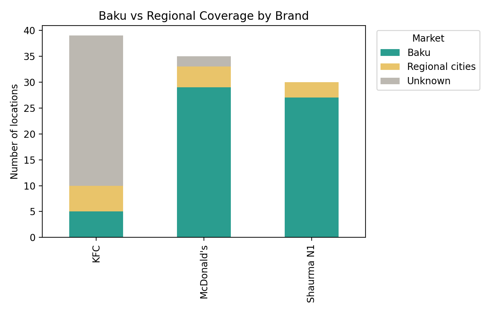
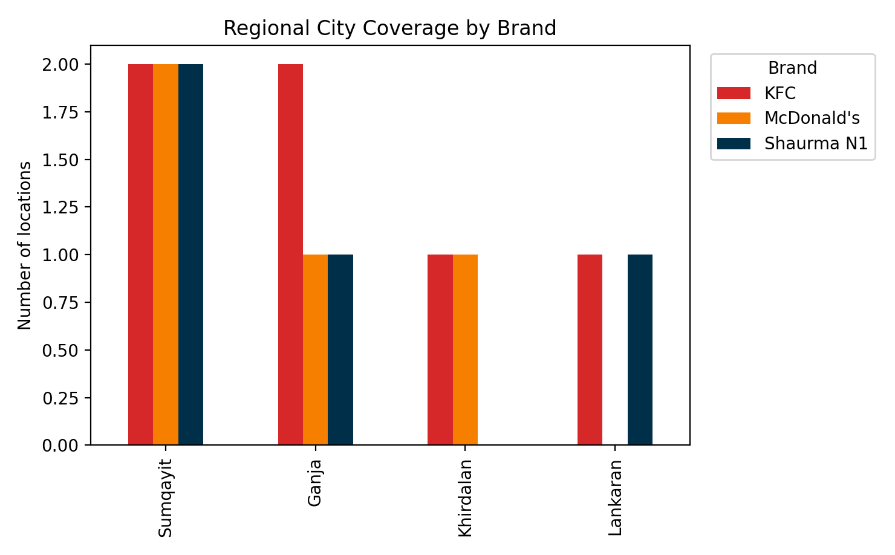
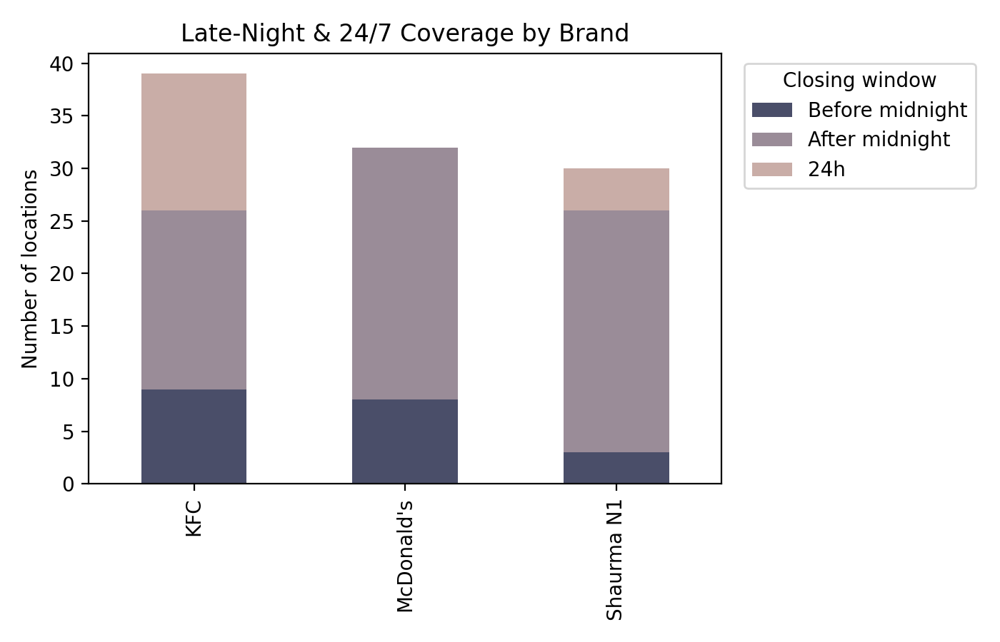
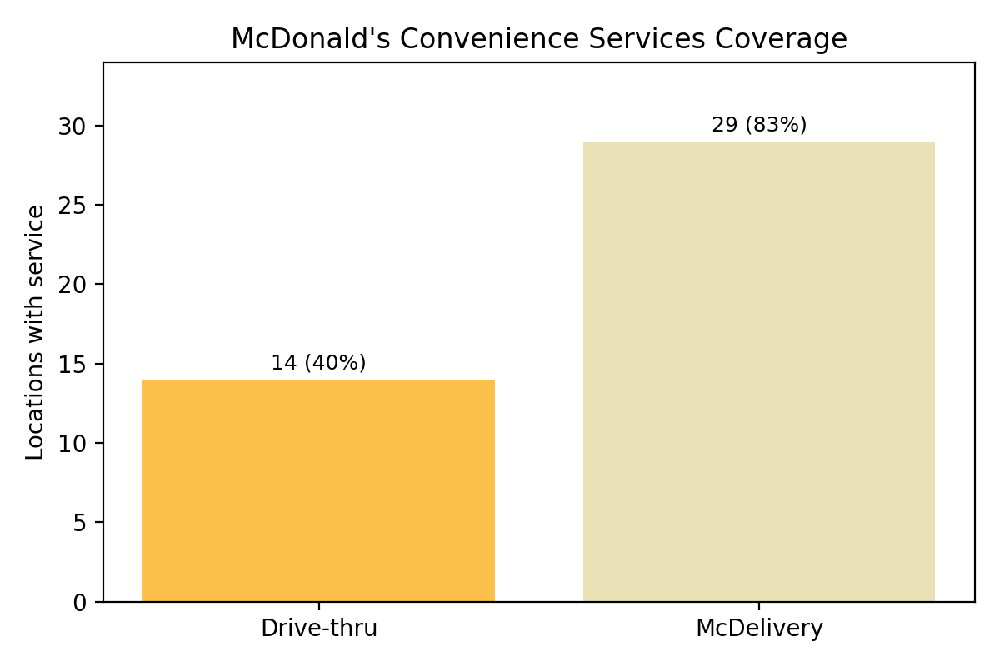
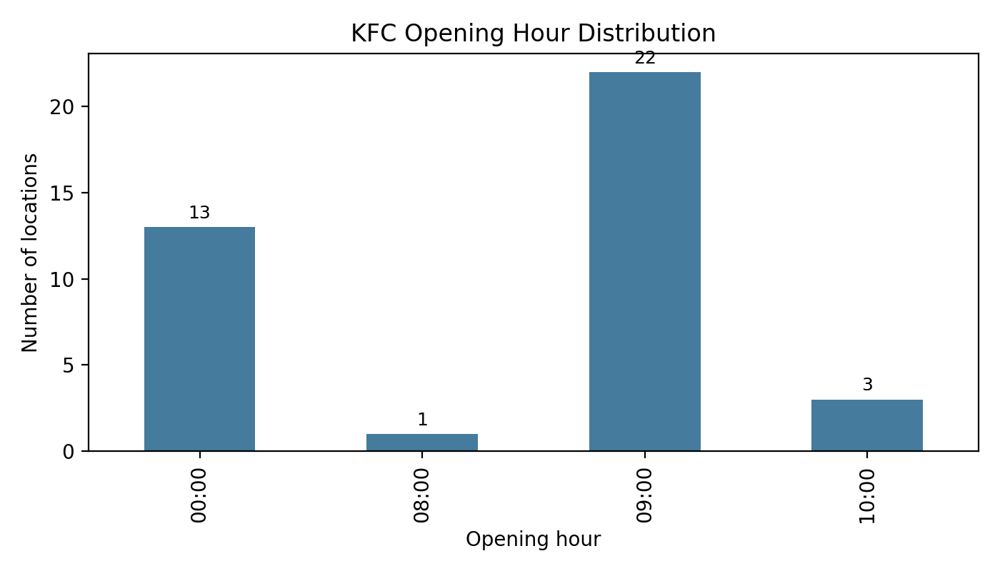

# Business Insights: Azerbaijan QSR Footprint & Operating Coverage

This report summarizes actionable business insights from the available location datasets for KFC, McDonald’s, and Shaurma N1 in Azerbaijan. The focus is on coverage, operating hours, and service availability that can inform network strategy, staffing, and customer access decisions.

## Executive Summary
KFC currently has the largest footprint, with McDonald’s close behind and Shaurma N1 the most concentrated. Late‑night access is a competitive differentiator across all brands, with Shaurma N1 and McDonald’s leaning heavily into after‑midnight service while KFC shows a sizable 24/7 component. McDonald’s delivery coverage is broad, while drive‑thru coverage is a clear growth lever. Most locations across brands are concentrated in Baku, with selective presence in regional cities.

**Why it matters**
- Market coverage often correlates with brand visibility and customer convenience.
- Footprint gaps identify expansion opportunities or potential over‑concentration.

**Decisions this can inform**
- Where to prioritize new site openings or co‑location strategies.
- Whether to defend or attack share in areas where a competitor has a denser network.

## Footprint Scale and Competitive Presence
KFC leads with **39** locations, followed by **35** for McDonald’s and **30** for Shaurma N1. The distribution indicates a tight competitive cluster between KFC and McDonald’s, with Shaurma N1 operating a smaller but still substantial network.

**Why it matters**
- A close footprint gap suggests competitive pressure in site performance and local marketing.
- The smaller network size for Shaurma N1 implies higher reliance on operational efficiency and late‑night differentiation.

**Decisions this can inform**
- Short‑term marketing and trade‑area targeting in contested districts.
- Expansion pacing and capital allocation by brand.

## Baku vs Regional Reach
Most locations are concentrated in Baku, while regional city presence is more selective. This creates clear opportunities to expand outside the capital or to double down on Baku density depending on growth strategy.

**Why it matters**
- Baku concentration supports operational efficiency and brand visibility, but limits growth headroom.
- Regional markets can offer lower competition and incremental demand capture.

**Decisions this can inform**
- Whether to allocate new openings toward underserved regional cities.
- Which brands should prioritize regional expansion versus Baku saturation.

## Regional City Focus
Among regional markets, coverage is concentrated in a small number of cities. This indicates that regional growth is currently selective rather than broad‑based.

**Why it matters**
- Over‑reliance on a few regional cities can create demand risk if local conditions soften.
- Regional diversification improves resilience and extends brand reach.

**Decisions this can inform**
- Target the next set of high‑potential regional cities.
- Optimize marketing spend across existing regional footprints.

## Late‑Night and 24/7 Coverage
Late‑night availability is a strong differentiator in QSR. After‑midnight coverage is high for all three brands, with Shaurma N1 and McDonald’s especially dominant in this window. KFC stands out with a notable number of 24/7 sites.

- KFC: **17** after‑midnight, **13** 24/7, **9** before midnight
- McDonald’s: **24** after‑midnight, **0** 24/7, **11** before midnight
- Shaurma N1: **23** after‑midnight, **4** 24/7, **3** before midnight

**Why it matters**
- Late‑night demand often carries higher margins and lower competition.
- 24/7 sites can serve as brand anchors and logistics hubs for delivery.

**Decisions this can inform**
- Where to extend operating hours to capture unmet demand.
- Which sites should be prioritized for staffing and security investment overnight.

## McDonald’s Convenience Services
McDonald’s shows strong delivery coverage but a smaller drive‑thru footprint.

- McDelivery available at **29 of 35** locations (**83%**)
- Drive‑thru available at **14 of 35** locations (**40%**)

**Why it matters**
- Delivery coverage supports revenue resilience and off‑premise growth.
- Drive‑thru capacity can reduce queue friction and lift throughput during peak hours.

**Decisions this can inform**
- Prioritize drive‑thru expansion or retrofits in high‑traffic corridors.
- Optimize delivery‑first staffing and routing in dense delivery zones.

## KFC Opening‑Time Readiness
Most KFC locations open at **09:00**, with a meaningful cluster operating from **00:00** (24/7). This indicates a strong late‑night strategy but fewer early‑morning starts.

- Open at 09:00: **22** locations
- Open at 00:00 (24/7): **13** locations
- Open at 10:00: **3** locations
- Open at 08:00: **1** location

**Why it matters**
- Opening hours directly influence breakfast and early‑day sales capture.
- Consistent opening times simplify marketing and customer expectations.

**Decisions this can inform**
- Whether to expand early‑morning service for incremental revenue.
- How to align breakfast promotions with actual store readiness.

## Recommended Business Actions
1. Prioritize late‑night and 24/7 investments where competitor coverage is weaker to capture high‑margin demand.
2. Expand drive‑thru coverage for McDonald’s in high‑traffic areas to boost throughput and reduce wait times.
3. Evaluate early‑morning expansion for KFC to compete more directly in breakfast occasions.
4. Use footprint proximity to tune local promotions and trade‑area tactics, especially in zones where KFC and McDonald’s overlap.
5. Decide whether the next wave of growth should target regional cities or deeper Baku penetration based on brand positioning.

